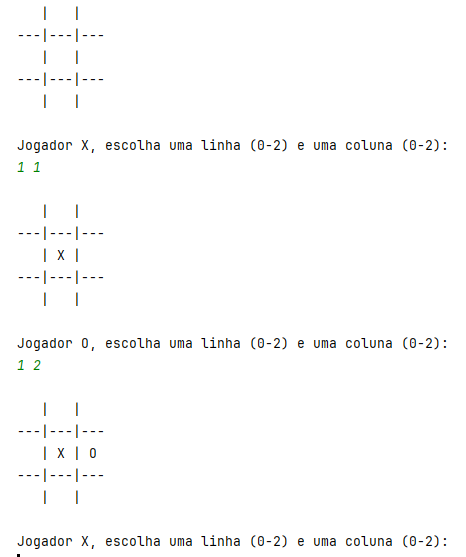

# Lab 6 - Criação de Classes em Java. 

## Aplicações Java 

:dart: Desenvolva os seguintes programas com recurso ao IDE `IntelliJ IDEA`.

:warning: Crie os diferentes exercícios em projetos separadas.

:warning: Não se esqueça de guardar o seu trabalho!  

## Exercícios :pen:

1. Para o diagrama de classe UML abaixo crie:

   - a definição de classe correspondente em código Java, e,

   - um pequeno programa de teste que evidencie as funcionalidades descritas. 

   ```
   +------------------------------------+
   |              Student               |
   +------------------------------------+
   | - id: int                          |
   | - name: String                     |
   | - age: int                         |
   | - course: String                   |
   | - grades: double[] = new double[10]|
   | - numGrades = 0                    |
   +------------------------------------+
   | + Student(id: int,                 |
   |            name: String,           |
   |            age: int,               |
   |            course: String)         |
   | + getId(): int                     |
   | + getName(): String                |
   | + getAge(): int                    |
   | + getCourse(): String              |
   | + getGrades(): double[]            |
   | + getNumGrades(): int              |
   | + setAge(age: int): void           |
   | + addGrade(grade: double): boolean |
   | + calculateAverage(): double       |
   | + toString(): String               |
   +------------------------------------+
   ```

   :bulb: Notas:

   - o método `addGrade` adiciona uma nova nota ao histórico de notas, e.g., `grades[numGrades++] = grade`, até ao máximo de 10 notas. Devolve `true` em caso de sucesso; `false`, caso contrário.

   - o método `getGrades` devolve uma **cópia** do array interno, ou seja, não devolve a referência do array (que seria potencialmente modificado no exterior da instância).

   - o método `setAge` deve validar o valor do parâmetro, i.e., não aceitar valores negativos.

---

2. Crie um projeto com uma classe `Vehicle` que representa um veiculo automóvel.

   > Um veiculo é caracterizado pela sua matrícula, quilometragem total (Km), número total de litros do seu depósito (capacidade) e o número de litros existentes no depósito (reserva incluída = 10 litros). Sabe-se também o seu consumo médio aos 100 Km. O veículo possui ainda um contador de viagens.

   * Todos os identificadores devem ser escritos em inglês.

   * Considere tipos de dados apropriados para cada um dos atributos.  

   * Evidencie o conceito de encapsulamento.

   * Represente a reserva de combustível como uma **constante**.
    
   * Crie um construtor que receba todos os atributos como parâmetro.
    
   * Defina os métodos _getters_ para todos os atributos.
   
   * Defina os métodos _setters_ para a capacidade do depósito e para o consumo médio.
   
   * Defina o método `toString()`.

   * Implemente os métodos que permitam o seguinte: 
   
      - Obter quantos quilómetros é possível percorrer com o combustível que está no depósito;

      - Registar uma viagem de `x` quilómetros e atualizar os dados do veiculo;

      - Verificar se um veículo já entrou na reserva, e;

      - Abastecer determinado número de litros de combustível, ou o máximo possível até ter um depósito cheio.
   
   
   📝Crie uma classe `VehicleProgram` (método `main`) que permita testar todas as funcionalidades definidas anteriormente.
   
---

3. O **Jogo do Galo** (em inglês [_Tic-Tac-Toe_](https://www.google.com/search?q=tic-tac-toe)) é um jogo muito popular, jogado num tabuleiro 3x3. O objetivo é alinhar três símbolos iguais numa linha, coluna ou diagonal antes do adversário o fazer. Os símbolos mais usados nestes jogo são: `'X'` e `'O'`. Os jogadores jogam de forma alternada, escolhendo a posição no tabuleiro onde querem colocar a jogada (linha/coluna).  

   Pretende-se, portanto, desenvolver uma classe (`TicTacToe`) que representa um jogo, de acordo com o seguinte:
   
   **Atributos**:
   
   - `board`: um array bidimensional de caracteres, inicialmente populado com o caractere (` ` _espaço_);
   - `currentPlayer`: um caractere, inicialmente `'X'` mas que alternará posteriormente com `'O'`;
   - `state`: um valor enumerado que representa o estado atual de uma partida. Os valores possíveis são: `IN_PROGRESS`, `END_DRAW`, `END_WON_X` e `END_WON_O`. Inicialmente o valor deste atributo será `IN_PROGRESS`.

      - O tipo enumerado deverá ser definido num ficheiro separado.

   **Métodos públicos**:

   - Método construtor sem parâmetros que inicializa o tabuleiro, o jogador inicial e o estado da partida;

   - Método `toString()` que mostra o estado atual do tabuleiro (ver exemplo abaixo);

   - Método _getter_ `getCurrentPlayer` que devolve o jogador atual (caractere);

   - Método _getter_ `getCurrentState` que devolve o estado atual do jogo;

   - Método `boolean gameHasEnded()` que devolve `true` se o jogo terminou; `false`, caso contrário;

   - Método `boolean makeMove(int line, int col)` que coloca no tabuleiro a jogada especificada para o _jogador atual_. 

      - Se o jogo já tiver terminado ou a jogada não for válida (coordenadas inválidas ou a célula já possui uma jogada), devolve `false`.

      - Se a jogada for colocada com sucesso:
      
         - Verifica se o jogo terminou (ver método `checkWinner`), ou, caso contrário alterna o valor do atributo `currentPlayer` para o outro jogador. ;

         - devolve `true`.
     

   **Métodos privados**:

   - Método `void checkWinner(char player)` que verifica se um jogo já terminou. 

      - Verifica se o jogador `player` obteu 3 símbolos em qualquer linha, coluna ou diagonal do tabuleiro. Em caso afirmativo, altera o estado do jogo para o enumerado respetivo (`END_WON_X` ou `END_WON_O`);

      - Caso contrário, verifica se todas as células do tabuleiro estão preenchidas. Neste caso significa que o jogo resultou num empate, pelo que altera o estado do jogo para o valor `DRAW`.
  

   :one: Crie uma classe `TicTacToeTest` (método `main`) que instancie um jogo e que simule a vitória de um jogador, apresentando o tabuleiro sempre que julgar necessário.

   :two: Se conseguir, crie uma classe `TicTacToeProgram` (método `main`) que instancie um jogo e que, enquanto o jogo não tiver terminado, vai solicitando a jogada do próximo jogador. Exemplo de execução: 

      

---

paula.miranda@estsetubal.ips.pt e bruno.silva@estsetubal.ips.pt
  
